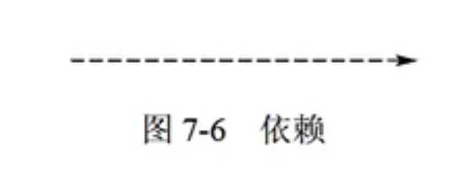
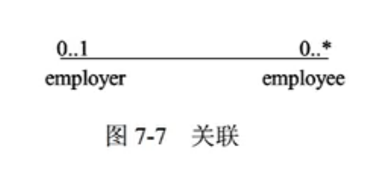
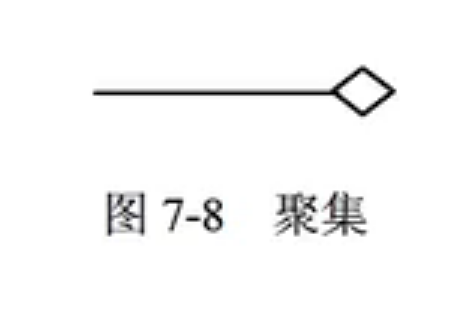
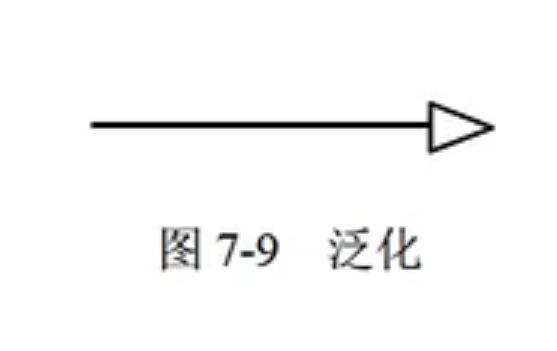
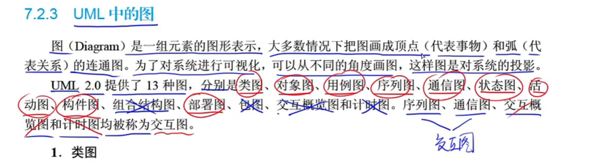
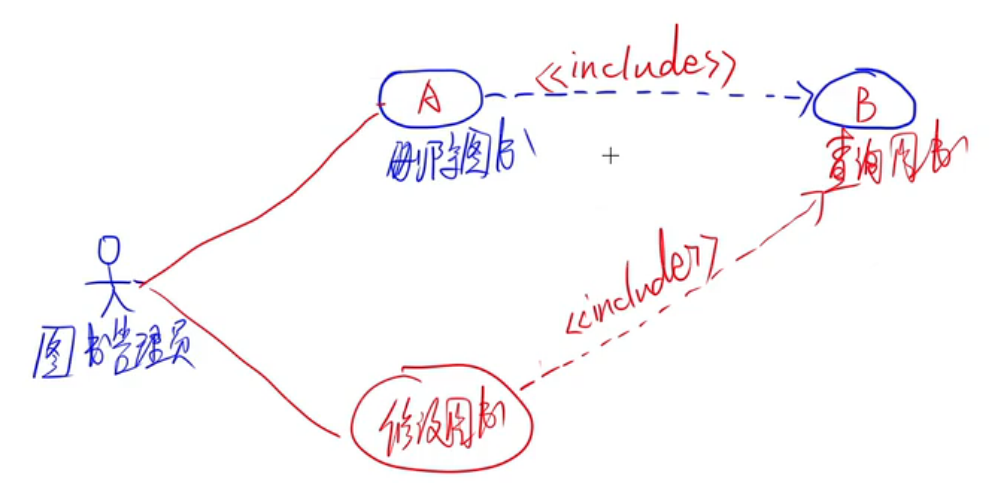
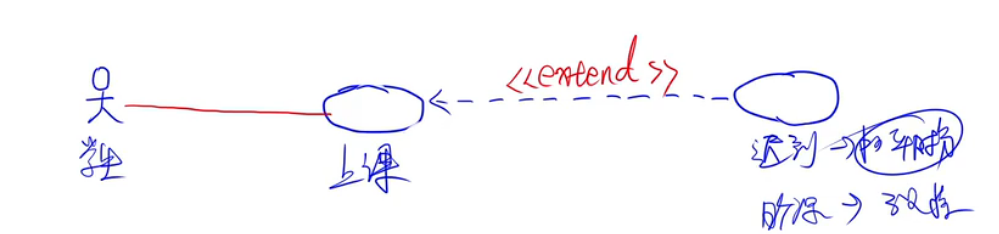
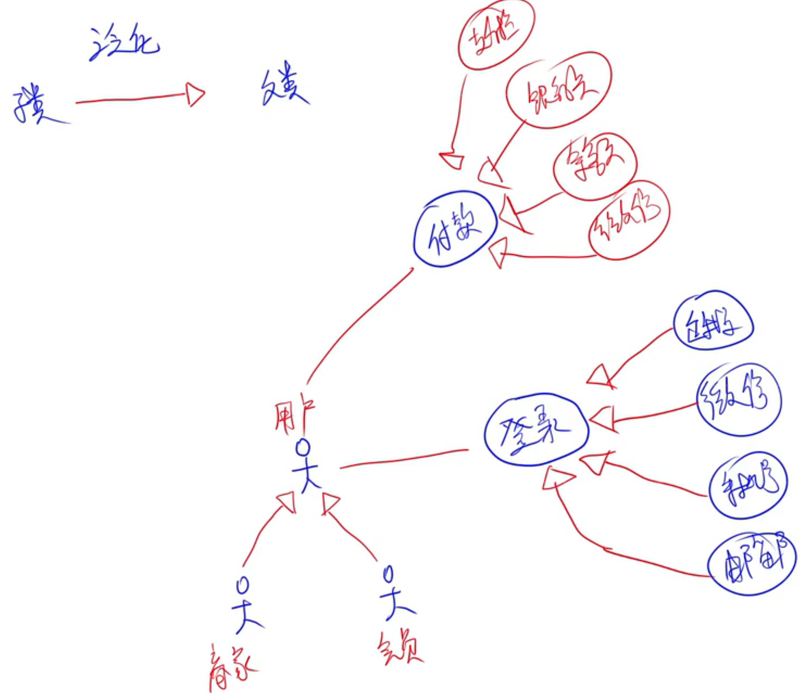

# 软件设计师理论

## 1. 计算机系统

### 补码

1. 补码的符号位是数值的一部分
2. 补码的补码是原码
3. 浮点数所能表示的数值范围主要由阶码决定，所表示数值的精度则由尾数决定。为了充分利用尾数来表示更多的有效数字，通常采用规格化浮点数。规格化浮点数将尾数区间限定在[-1,-0.5]，[0.5,1]。

4. 如果浮点数的阶码（包括1位阶符）用R位的移码表示，尾数（包括1位数符）用M位的补码表示，则这种浮点数所能表示的数值范围如下：

最大的正数:（尾数拉满：$$1 - 2^{ - (M - 1)}$$）
$$
(1 - 2^{ - (M - 1)}) \times 2^{(2^{R - 1} - 1)}
$$
最小的负数：（尾数为0时即最大）
$$
-1 \times 2^{(2^{R - 1} - 1)}
$$

### 流水线

1. 最大吞吐率取决于流水线中最慢一段所需的时间。
2. 如果流水线出现断流，加速比会明显下降。
3. 要使加速比和效率最大化应该对**流水线各级采用相同时间**的运行时间。


### 指令

1. CPU依据指令周期的不同阶段来区分在内存中以二进制编码形式存放的指令和数据。


## 2. 程序涉及语言


## 3. 知识产权


## 4. 数据库


## 5. 面向对象


## 6. UML


## 7. 设计模式


## 8. 操作系统


## 9. 结构化开发


## 10. 软件工程


## 11. 信息安全


## 12. 计算机网络


## 13. 数据结构


## 14. 算法


# 软件设计师应用


## 1. 数据流图

### 1.1 注意点

1. 慢慢读题，从0层数据流图写答案
2. 一定要校验一层与0层数据流图的关系，并且/符号的内容不能少
3. 注意，题目中的加工到仓库不一定只有一条数据流，一定要按细节补全
4. 数据流的解释可以不管
5. 加工说明中出现的其他仓库的名词一定要注意，经常需要从其他仓库调用数据
6. 注意，图中加工输出的数据流内容，可能暗示了需要的仓库内容
7. 加工不会自带数据，在原文中提到的加工内容需要从仓库里调来
8. 别把操作数据流丢给实体

### 1.2 常见问题

1. E1和E2实体之间是否有数据流？

   E1和E2之间不可以有数据流，因为数据流起点和终点中必须有一个是加工。

   

2. 说明图中存在问题？

   图2加工*（加工号）中只有输出数据流，没有输入数据流/只有输出数据流，没有输入数据流；

   是黑洞/奇迹；

   父图与子图不平衡，父图/子图中缺少"*（数据流名）"数据流。

   

3. 若发送给学生和讲师的通知是通过第三方Email系统进行的，则需要对图1和图2进行哪些修改？

   此时，若通过第三方Email系统将"*（数据流名）"发送给E，则第三方Email系统即为外部实体，而非本系统内部的加工。

   图1中，添加外部实体“Email系统”，并将加工A到E的数据流"*（数据流名）"的终点改为“Email系统”。

   图2中，添加外部实体“Email系统”，并将加工A到E的数据流"*（数据流名）"的终点改为“Email系统”……。

   

4. 实际的证券交易通常是在证券交易中心完成的，因此，该平台的“证券交易”功能需将交易信息传递给证券交易中心。针对这个功能需求，需对图1和图2进行哪些修改？

   对图1增设外部实体“证券交易中心”，增加一条数据流“交易信息”，起点：证券交易平台；终点：证券交易中心。

   对图2增设外部实体”证券交易中心“，将”交易信息“数据流终点改为证券交易中心。


5. 如何保持数据流图平衡？

   父图中加工的输入输出数据流，必须与子图中的输入输出数据流在数量上和名字上相同。

   父图中的一个输入（输出）数据流对应子图中几个输入（输出）数据流，

   而子图中组成这些数据流的数据项全体正好是父亲图中的这一条数据流。


6. 根据说明中术语，给出数据流”学生状态“和”学生信息“的组成。

   **以数据字典形式书写**

   学生状态 = 学生卡ID+心率+体温+位置+时间

   学生信息 = 学生ID+学生卡ID+1{家长ID}*+班主任ID+班级


7. 结构化语言对某加工逻辑进行描述。

   > **结构化语言**
   > 结构化语言是一种介于自然语言和形式化语言之间的半形式化语言，是自然语言的一个受限子集。
   > 结构化语言没有严格的语法，它的结构通常可分为内层和外层。外层有严格的语法，内层的语法比较灵活，可以接近于自然语言的描述。
   > (1）外层。用来描述控制结构，采用**顺序、选择和重复**3种基本结构。
   > ①**顺序结构**。一组祈使语句、选择语句、重复语句的顺序排列。祈使语句是指至少包含一个动词及一个名词，指出要执行的动作及接受动作的对象。
   > ②**选择结构**。
   > 般用IF-THEN-ELSE-END、CASE-OF-ENDCASE等关键词。
   > ③重复结构。一般用DO-WHILE-ENDDO、REPEAT-UNTIL等关键词。
   > (2)内层。一般采用祈使语句的自然语言短语，使用数据字典中的名词和有限的自定义词，其动词含义要具体，尽量不用形容词和副词来修饰，还可使用一些简单的算法运算和逻辑运算符号。

   ```null
   	寻找物流商:
   
   ​	有新订单时
   ​	IF 订单类型为保卖车或全国购
   ​		THEN 直接分配到竞拍体系中，最优报价物流商中标
   ​	ELSE
   ​		IF 订单路线符合固定路线和/或包车路线
   ​			THEN 自动分配给合约物流商
   ​		ELSE 
   ​			将订单信息分配到竞拍体系中，最优报价物流商中标
   ​		ENDIF
   ​	ENDIF
   ​	给承运的物流商发送物流消息
   ​	更新订单的物流信息
   ​	给车辆交易系统发送物流信息
   ```


## 2. 数据库设计


### 2.1 E-R图 

#### 2.1.1 实体

1. E-R图基本图形元素：实体（矩形）、属性（圆角矩形）、联系（菱形），其中 n，m，\*均形容实体的多数。特别的，有弱实体和子实体。

2. 弱实体对于与其联系的实体具有依赖关系。弱实体以双边矩形表示。
3. 子实体（子类）继承原来的实体（超类），拥有原来实体的属性和行为，也有其自己的行为，用橡皮擦形状表示。子实体与实体之间的连接用直线和圆圈表示。

#### 2.1.2 属性

1. 每个实体的属性极其域时是相同的，但可能取不同的值。
2. 简单属性和复合属性。简单属性是原子的、不可再分的；复合属性可以细分为更小的部分。
3. 单值属性和多值属性。单值属性，定义的属性对于一个特定的实体都只有一个单独的值。多值属性，一个属性可能对应一组值。
4. NULL属性。当实体在某个属性上没有值或属性值未知时，使用NULL值。
5. 派生属性。派生属性可以从其他属性得来。例如职工实体集中有“参加工作时间”和“工作年限”属性，那么“工作年限”的值可以由当前时间和参加工作时间得到。


#### 2.1.3 联系

1. 在E-R模型中，联系用菱形表示，通常菱形框内写联系名，并用无向边分别与有关实体连接起来，同时在无向边旁标注上联系的类型。实体的联系分为实体内部的联系和实体之间的联系。实体内部的联系反映数据在同一记录内部各字段之间的联系。

2. 一对一、一对多、多对多关系。

   

### 2.2 关系模式和主键外键

1. 关系模式：对关系的描述称为关系模式，由关系名和其属性集合构成，关系模式的格式为：

   关系名（属性名1，属性名2，…，属性名n）

2. 候选键：属性或属性组合，其值能够唯一地标识一个元组。

3. 主键：在一个关系中可能有多个候选键，从中选择一个作为主键。

4. 外键：如果一个关系中的属性或属性组并非该关系的码，但它们是另外一个关系的码，则称其为该关系的外码。

5. 一对多联系的转换。一对多联系有两种方式向关系模式进行转换。一种方式是将联系转换成一个独立的关系模式，关系模式的名称取联系的名称，关系模式的属性取该联系所关联的两个实体的码及联系的属性，关系的码是多方实体的码；另一种方式是将联系归并到关联的两个实体的多方，给待归并的多方实体属性集中增加一方实体的码和该联系的属性即可，归并后的多方实体码保持不变。

6. 超类和子类的关系转换。超类、子类实体都可以转换为一个关系，并将超类实体的主键添加到子类实体中。如果子类没有对应属性的话可以不用转换。

   > 例子：
   >
   > 职员：职工号，姓名，性别，年龄，参加工作时间
   >
   > 飞行员：飞行小时，健康检查，飞机型号
   >
   > 机械师：学历，级别，专业职称
   >
   > 管理员：职务，职称
   >
   > 
   >
   > E-R图转关系模式：
   >
   > 职员（职工号，姓名，性别，年龄，参加工作时间）
   >
   > 飞行员（职工号，飞行小时，健康检查，飞机型号）
   >
   > 机械师（职工号，学历，级别，专业职称）
   >
   > 管理员（职工号，职务，职称）

   


## 3. UML

### 3.1 关系

UML中有4种关系：依赖、关联、泛化、实现。

#### 3.1.1 依赖

1. 依赖是两个事物之间的语义关系。其中一个事物（独立事物）发生变化会影响另一个事物（依赖事物）的语义。在图形上，把一个依赖画成一条可能有方向的虚线。

   

#### 3.1.2 关联

1. 关联是一种结构关系，它描述了一组链，链是对象之间的连 接。聚集是一种特殊类型的关联，它描述了整体和部分之间的结构关系。关联和聚集的图形化表示为：

   

   

   

2. 对于聚集，有聚合和组合。

   聚合： 部分和整体的生命周期不一致，整体消失了，部分任然存在，部分可以脱离整体存在。

   组合： 部分和整体的生命周期一致，整体消失了，部分也消失了，部分不可以脱离整体而存在。组合为**实心的聚集符号**。

#### 3.1.3 泛化

1. 泛化是一种特殊关系，特殊元素（子元素）的对象客替代一般元素（父元素）的对象，这种方法，子元素共享了父元素的结构和行为。图形表示如下。（子用例指向父用例）



#### 3.1.4 实现

实现是类元之间的语义关系，其中一个类元制定了由另一个类元保证执行的契约。在两种情况下会使用实现关系：一种是在接口和实现它们的类或结构之间；另一种是在用例和实现它们的协作之间。


### 3.2 UML中的图




####  3.2.1 类图

类图展现了一组对象、接口、协作和它们之间的关系。在面对对象系统的建模中所建立的最常见的图就是类图

1. 类图中的符号：

   > +:public
   >
   > -:private
   >
   > #:protected
   >
   > ~:package

   

#### 3.2.2 用例图

1. 用例图展现了一组用例、参与者以及它们之间的关系。用例图通常包括以下内容：

​	用例、参与者、用例之间的扩展关系(<\<extend \>>)和包含关系(<\<include\>>)，参与者和用例者之间的关联关系，用例与用例以及参与者与参与者之间的泛化关系。


2. 包含关系：（虚线<\<include\>>小箭头）



如图所示，删除图书工作包含了查询图书，修改图书工作包含了查询图书；进行删除图书或修改图书的用例，必须先进查询图书的用例。


3. 扩展关系：（虚线<\<extend \>>小箭头）



如图所示，扩展关系由特殊用例指向基础用例。


4. 泛化关系

   
