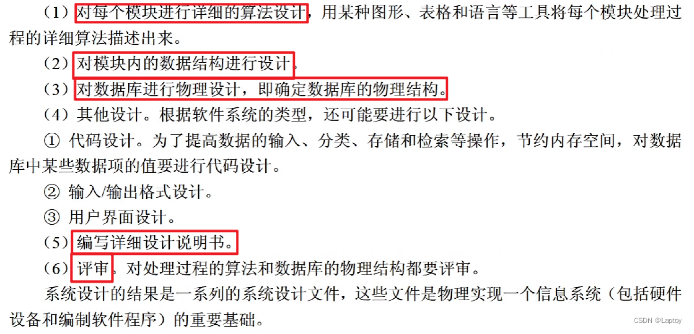
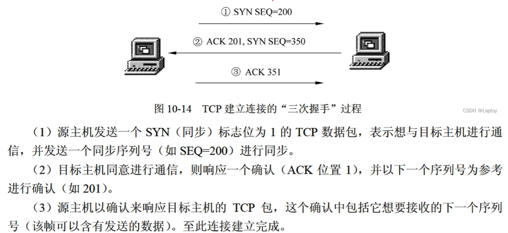
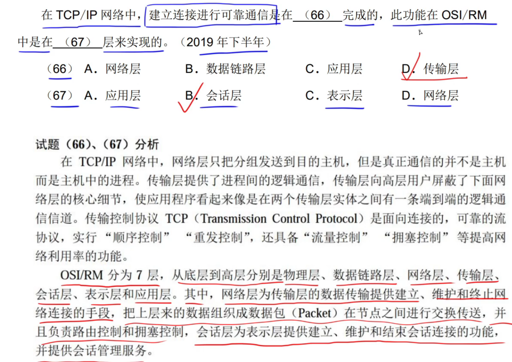
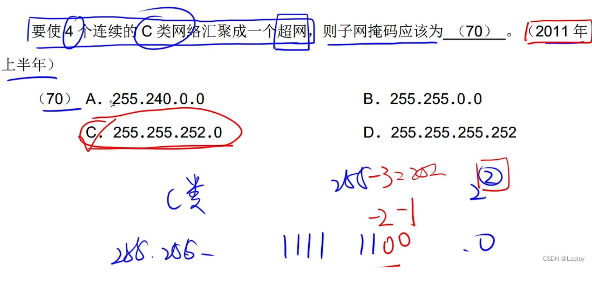
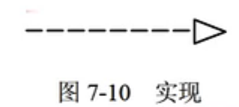

# 软件设计师理论

## 1. 计算机系统

### 补码

1. 补码的符号位是数值的一部分
2. 补码的补码是原码
3. 浮点数所能表示的数值范围主要由阶码决定，所表示数值的精度则由尾数决定。为了充分利用尾数来表示更多的有效数字，通常采用规格化浮点数。规格化浮点数将尾数区间限定在[-1,-0.5]，[0.5,1]。

4. 如果浮点数的阶码（包括1位阶符）用R位的移码表示，尾数（包括1位数符）用M位的补码表示，则这种浮点数所能表示的数值范围如下：

最大的正数:（尾数拉满：$$1 - 2^{ - (M - 1)}$$）
$$
(1 - 2^{ - (M - 1)}) \times 2^{(2^{R - 1} - 1)}
$$
最小的负数：（尾数为0时即最大）
$$
-1 \times 2^{(2^{R - 1} - 1)}
$$

### 流水线

1. 最大吞吐率取决于流水线中最慢一段所需的时间。
2. 如果流水线出现断流，加速比会明显下降。
3. 要使加速比和效率最大化应该对**流水线各级采用相同时间**的运行时间。


### 指令

1. CPU依据指令周期的不同阶段来区分在内存中以二进制编码形式存放的指令和数据。


## 2. 程序涉及语言


## 3. 知识产权


## 4. 数据库

### 关系代数

#### 自然连接

关系代数中的自然连接一般去除后面部分的相同项。


### SQL

1. sql中的整型数据，如果加了引号，处理时会自动转换为整型，而不会视为字符串类型。(一般对数值不加引号)

2. sql体系结构：由视图（外模式）、基本表（模式）和存储文件（内模式）三部分结构组成。 

3. DDL：数据定义语言，DML：数据操纵语言，DQL：数据查询语言，DCL：数据控制语言（包括数据库对象的权限管理和控制管理）。

   

#### 完整性约数子句：

PRAIMARY KEY主键字句（实体完整性），CHECK检查子句（用户自定义完整性），FOREIGN KEY外键子句（参照完整性）。

列级完整性约数语句：not null不为null，unique值唯一，default默认值

外键参照另外一个表的主键语句：

```mysql
create table S

(

	sid int,

	primary key(sid)    #将sid设置为S的主键

)


create table R

(

	cid int,

	sid int,
 
	foreign key(sid) references S(id)  #将sid设置为参照S的外键
    check (cid >= 0 and cid <= 100)  #将cid列约数设置为0到100

)


```


#### 数据定义语言

包括 CREATE、ALTER和DROP

```mysql
#增加一个新列的基本语句
ALTER TABLE 表名 ADD 列名 类型

#修改一个列类型的基本语句
ALTER TABLE 表名 modify COLUMN 列名 新类型

#删除一个列的语句
ALTER TABLE 表名 DROP COLUMN 列名

#删除基本表
DROP TABLE 表名

#删除test表
DROP TABLE test
```


#### 操纵语句

```mysql

#插入
insert into student values("108","曾华","男","1992-09-01","09033")
#表示在student表中插入一行："108","曾华","男","1992-09-01","09033"
inset into student(姓名，学号，性别,出生日期) values("曾华",113,"男","1992-09-01")
#指针对“姓名，学号，性别,出生日期”这些列进行数据插入，没有提到的列设为null 


#用*表示选择全部内容
select * from student


#删除操作
DELETE FROM 表名 [WHERE 条件表达式]
DELETE FROM student where 班号 = "95031"


#UPDATE修改语句
UPDATE 表名
SET 列名 = 值表达式
[WHERE 条件表达式]

```


#### 数据查询语言

```mysql
 SELECT子句中的输出项可以是列名，或者由列名、常熟和"+"、"-"、"*"、"/"运算符构成的算数表达式，使用DISTINCT选项可以保证查询结果集中不存在重复元组。FROM子句中出现多个基本表或视图时，系统首先执行笛卡尔积操作。WHERE子句的条件表达式中可以使用的运算符有：比较运算符（<,<=,>,>==,<>）和BETWEEN运算符；逻辑运算符（AND、OR、NOT）；集合成员运算符（IN、NOT IN）；字符串匹配运算符（LIKE）；谓词（EXISTS、ALL、SOME、UNIQUE）；聚合函数；空值比较运算符（IS NULL、IS NOT NULL）；集合运算符（UNION、 INTERSECT、EXCEPT）等。
```

1. sql中**LIKE**语句可以支持模糊搜索，即利用"王%"表示王后续可跟任意内容，或者"王__"表示必须选择王后面根两个字符的内容。


可以使用select配合**AS**将查询内容的列名以别名形式呈现，这里as也可以用空格代替。


#### 排序语句

利用ORDER BY，默认为升序ASC，降序为DESC。


#### 聚合函数

聚合函数实现数据统计等功能，用于对一组值进行计算并返回一个单一的值。


#### 数据分组

如图所示，对课程号进行分组操作，由于有三种不同的课程号，因此被分为三组。这三组的分数和与分数平均值分别单独计算。


#### 组合使用

条件中有聚合函数，不能用where，需要用having。


进行聚合MIN和MAX语句时，是对分组后的数据进行的。


#### 连接语句

内连接


1. 等值连接


注意，如果按照下图方式进行等值连接，没法将score表中的学号去重


，则可以在一开始人工排除score中要连接的列。


2. 非等值连接


3. 自连接

  


4. 外连接 

左外连接：


右外连接：


全外连接：


#### 子查询

相当于用嵌套的形式使用where语句。


ANY，下图所示sql语句中， > ANY (...)说明只要大于'3-245'中的任意一个分数，就成立。


#### EXISTS与NOT EXISTS

EXISTS通常放在where中，用来判断后面语句，为真的内容留下。

NOT EXISTS通常放在where中，用来判断后面语句，为假的内容留下。


#### SQL控制语句

数据控制控制的是用户对数据的存储权力，是由DBA决定的。但是，某个用户对某类数据有何种权利，是个政策问题而不是技术问题。DBMS的功能就是保证这些决定的执行。因此，DBMS数据控制应具有以下功能。

**GRANT（授权），REVOKE（收回权限）**

**WITH GRANT OPTION**并将此权限赋给其他用户


#### 视图

视图是一个虚拟表，查询时可以从一个或者多个基本表或视图中到导出。

**WITH CHECk OPTION**表示修改、插入操作时该视图只有计算机类的图书。


#### 索引

1. 基于内模式


### 函数依赖的公理系统

设关系模式R(U,F)，其中U为属性集，F是U上的一组函数依赖，那么有以下推理规则。


 

### 范式

#### 第一范式

1. R是一个关系模式，其中R中属性均为原子项，不可分割。

2. 1NF不能排除数据冗余和更新异常等问题，因为其中可能存在部分函数依赖。

#### 第二范式 

1. 当且仅当R是1NF，且每个非主属性都完全依赖于候选码。（即需要对第一范式去除**部分函数依赖**）

2. 进行关系模式的分解可以消除函数中的部分依赖。
3. 2NF的关系模式R也可能存在数据冗余和更新异常等问题，**因为其中可能存在传递函数依赖**。


#### 第三范式

1. R属于第三范式当且仅当R是2NF，且每个非主属性都非传递函数依赖于候选码。
2. 一个不属于3NF的关系模式R会产生插入异常、删除异常和修改复杂等问题。属于3NF的关系模式R可能存在主属性对码的部分依赖和传递依赖。


#### BC范式

1. 当且仅当其F中每个依赖的决定因素必定包含R的候选码。

2. 一个满足BCNF的关系模式有：

   所有非主属性对一个码都是完全函数依赖

   所有的主属性对一个不包含它的码，也是完全函数依赖

   没有任何主属性完全函数依赖于非码的任何一组属性

3. 一个BCNF的关系模式R**已经消除了插入和删除异常**。

#### 关系模式的分解


### 无损连接

1. 无损连接的充要条件


2. 注意：要实现无损连接，需要有相同关键字，否则没有办法完成自然连接。

   


#### 第四范式


### 数据库设计

1. 用户需求分析：收集用户需求，确定系统边界，数据流图，数据字典，说明文档
2. 概念设计：E-R图
3. 逻辑设计：关系模式，规范化，（1对几联系）
4. 物理设计


#### 逻辑设计


### 排他锁和共享锁


## 5. 面向对象


## 6. UML


## 7. 设计模式


## 8. 操作系统

### PV操作

1. P，V操作都是检查加后继操作。对于检查操作，我们可以根据进程之前与之后需要进行什么样的检查来确定操作对象（即信号量 S1、S2）。对于后继操作，我们可以根据进程本身来确定使用P操作还是V操作。
2. 互斥操作的PV均紧挨需要独立进行的操作前后。**互斥概念量化：**例如，如果生产者和消费者同时对缓冲区进行操作(2 + 1 , 2 - 1 得到 1而非2)，那么可能导致操作结束后系统读到的缓冲区数量和缓冲区真实产品的数量产生不一致。因此，放入缓冲区和从缓冲区取出的操作是互斥的，对缓冲区操作的行为需要独立出来。

### 进程资源图

1. 可化简的含义是进程非死锁，可按照顺序完成进程操作。
2. 阻塞节点是分配完成后，某节点在申请时没有余留的资源。有阻塞节点时不一定死锁。

### 线程与进程关系

1. 同一个进程中的线程，线程与线程之间不可见。但线程可以共享进程当中的资源。


### 磁盘读写

#### 旋转调度算法


此题目重点注意每次处理完成后，磁头旋转到哪个位置。用那个对应位置进行下一次旋转的时间计算，同时注意别忘了处理时间和单扇区片段的时间。对于优化，进行错位添加即可。


其中，$$27 \div 9 \div 3 = 1$$，说明处理完成一个扇区，磁头停在了一个扇区后的开始。因此，再转到这个位置可以少转1个扇区。
$$
(27 - 1\times3)\times 8 + (3 + 3)\times 9 = 246
$$


#### 磁盘转速


#### 磁盘移臂调度和旋转调度顺序


### 文件管理


这里的磁盘块表示磁盘索引块和磁盘数据块的大小均为512B。


### 进程空闲区

1. 在进程释放之后，注意进程空闲区的合并。


### 位视图

1. 如果题目没有明确说明字的编号从1还是0开始，默认字从1开始编号。


### I/O系统

1. I/O系统的层次结构与每层的主要功能。


## 9. 结构化开发


## 10. 软件工程

### 能力模型

####  CMM（能力成熟度模型）


#### CMMI（能力成熟度集成模型）

1. 阶段式模型

   类似于CMM


2. 连续式模型

   


#### 增量模型


本题中，最适合需求被清晰定义的模型是瀑布模型。最适合大规模团队开发的项目是螺旋模型。

增量模型可以快速构造核心产品，这使得后续增加功能后测试过程中核心功能可以得到更多的测试。


#### 演化（迭代）模型


#### 原型模型（需求模糊 规模小）


原型模型不适用于规模大的软件


#### 螺旋模型（风险分析 规模大）

螺旋模型的特点是加入了**风险分析**，适合**大规模高风险**的，需求变化的系统


#### 喷泉模型


1. 开发活动不存在明显的边界，允许分析设计编码交叉迭代进行。

2. 开发效率有所提高，节省时间。

3. 项目和文档管理难度较大。
4. 以需求为动力。
5. 面向对象。

#### 统一过程（UP）模型


### 敏捷开发


极限编程中的结对编程，不一定会让编码速度更快。


### 需求分析


### 概要设计（模块、接口、数据结构、数据库）

1. 设计软件系统总体结构（模块、接口）

2. 数据结构及数据库设计

   

3. 编写概要设计文档
4. 评审


### 详细设计（数据结构、算法、数据库）




### 测试

1. 系统测试阶段的测试目标来自于需求分析阶段


### 单元测试


单元测试主要检查5个特征：

1. 模块接口
2. 局部数据结构
3. 重要的执行路径
4. 出错处理
5. 边界条件


单元测试过程：
由于模块不是独立原型的程序，各模块之间存在调用与被调用的关系。在对每个模块进行测试时，需要开发两种模型。

1. **驱动模块**，相当于主程序。
2. **桩模块**，代替用来测试的子模块。


### 集成测试

自顶向下集成不需要驱动模块，自底向上不需要桩模块

#### 非增量集成

分别测试各个模块，再把这些模块组合起来进行整体测试。

可以对模块进行并行测试，充分利用人工，并加快工程进度。但这种方法容易混乱，出现错误不容易查找和定位。

#### 增量集成

以小增量的方式逐步进行构造和测试。

增量式测试的范围一步步扩大，错误容易定位，更易于对接口进行彻底测试，并且可以运用系统化的测试方法。

1. **自顶向下集成测试**

自顶向下集成不需要驱动模块

深度优先集成是首先集成位于程序结构中主控路径上的所有构件。


2. **自底向上集成测试**

自底向上不需要桩模块

随着集成向上进行，对单独的测试驱动模块的需求减少。事实上，若程序结构的最上两层是自顶向下集成的，驱动模块的数量可以大大减少，而且簇的集成得到明显的简化。


3. **回归测试（应对变更）**

回归测试有助于保证变更不引入无意识行为或额外的错误。回归测试要执行的测试子集包含以下3种测试用例。


回归测试用例设计成只包括设计每个主要程序功能的一个或多个错误类的测试。


4. **冒烟测试**


### 测试方法


### 黑盒测试

1. 黑盒测试也称为功能测试，再完全不考虑软件的内部结构和特性的情况下，测试软件的外部特性。

2. 常用的黑盒测试技术有：


1. 等价类划分：

   等价类划分法将程序的输入域划分为若干等价类，然后从每个等价类中选取一个代表性数据作为测试用例。这样可以用少量代表性测试用例取得较好的测试效果。

2. 边界值分析：

   输入的边界比中间更容易发生错误，因此用边界值分析来补充等价类划分的测试用例设计技术。

3. 错误推测：

   错误推测是基于经验和直觉推测程序中所有可能存在的各种错误，从而有针对性地设计测试用例的方法。

4. 因果图：

   因果图法是从自然语言描述的程序规格说明中找出因（输入条件）果（输出或程序状态的改变），通过因果图转换为判定表。


等价类划分测试中，测试用例允许一个不在范围内。


### McCabe度量法


$$
m - n + 2  即为程序复杂度
$$


* 软件复杂性看代码行数
* 


### 白盒测试

1. 白盒测试常用的技术：逻辑覆盖、循环覆盖、基本路径测试。

#### 逻辑覆盖

逻辑覆盖考察用测试数据运行被测程序时对程序逻辑的覆盖程度。

1. 语句覆盖：选择足够测试数据，使被测程序中每条语句至少执行一次，很弱。
2. 判定覆盖：设计足够的测试用例，使得每个判定表达式都至少获得一次“真”值和“假”值。


1. 条件覆盖：使判定语句中每个逻辑条件的各种可能的值至少满足一次。


1. 判定/条件覆盖：使得判定中每个条件的所有可能取值（真/假）至少出现一次，并使每个判定本身的判定结果（真/假）也至少出现一次。


1. 条件组合覆盖：每个判定条件中各种可能的组合都至少出现一次。
2. 
3. 路径覆盖：路径覆盖指覆盖被测试程序中所有可能的路径。


#### 循环覆盖

执行足够的测试用例，使得循环中的每个条件都得到验证。


#### 基本路径测试

基本路径测试法是在程序控制流图的基础上通过分析控制流图的环路复杂性，导出基本可执行路径集合，从而设计测试用例。


#### 白盒测试的原则


### 维护

* 系统可维护性的评价指标：

  可理解性、可测试性、可修改性


#### 软件维护


## 11. 信息安全


## 12. 计算机网络

### URL

1. url结构：  https://www.ruankao.org.cn   协议名://主机名.域名.域名后缀.域名分类/目录/网页文件


### 邮件协议

1. SMTP和POP3（电子邮件协议）

   SMTP**发**邮件的协议，端口号25，用TCP端口，只能传输文本和ASCII码的文件

   PEM是加密邮件的协议

   MIME是邮件扩充协议（可以理解为增强邮件传输功能的协议）可发多媒体数据

   POP(POP3)是用来**接受**邮件并保管好邮件的协议，用TCP端口，端口号是110，采用C/S模式进行通信。


### Telnet远程登录服务

1. 远程登陆协议使用到的TCP端口为23号


### FTP文件传输服务

1. FTP基于C/S模式的服务系统，由客户端软件、服务器软件和FTP通信协议3个部分组成。
2. 设置了anonymous的公共用户账号
3. 控制连接21号端口：传输命令和参数  
4. 数据连接20号端口：传送文件
4. 默认情况下，FTP服务器控制端口为21


### DHCP协议

TCP 67号端口

1. DHCP（动态主机配置协议）

2. DHCP协议的功能是：集中的管理、分配IP地址、使网络环境中的主机动态的获得IP地址、Gateway地址、DNS服务器地址等信息，并能够提升地址的使用率。

3. DHCP客户端可以从DHCP服务器获得本机IP地址、DNS服务器地址、DHCP服务器地址和默认网关的地址等。

4. Windows无效地址：169.254.X.X，Linux无效地址：0.0.0.0


### ARP和RARP协议

地址解析协议（ARP）及反地址解析协议（RARP）是驻留在**网络层（ISO/OSI），网际层（TCP/IP）**中的重要协议。

1. ARP的作用是将IP地址转换为物理地址
2. RARP的作用是将物理地址转换为IP地址
3. 网络中任何设备、主机、路由器和交换机等均有唯一的物理地址
4. 用ARP进行IP地址到物理地址（MAC地址）的转换过程：


5. RARP负责物理地址（MAC地址）到IP地址的转换，主要用于无盘工作站。无盘工作站有物理地址但没有IP地址。


### ICMP协议

1. ICMP属于网际层协议，是一个专门用于发送差错报文的协议。

2. ICMP定义了5种差错报文（源抑制、超时、目的不可达、重定向和要求分段）

3. ICMP定义了4种信息报文（回应请求、回应应答、地址屏蔽码和地址屏蔽码应答）


### IP协议


### SNMP协议

1. 简单网络管理协议

2. 在应用层

3. **传输层协议一般采用UDP**


### TCP协议


流量控制采用的是：可变大小的滑动窗口协议。


* TCP的三次握手




* **注意：先断开TCP连接再进行浏览器解析**


### 测试网络程序


* HDLC为数据链路层协议，它对流量控制的协议是：固定大小的滑动窗口协议。应对通信延迟固定的情况。
* TCP为传输层协议，它对流量控制采用的是：可变大小的滑动窗口协议。应对通信延迟不固定的情况。


### DNS协议


### 各种协议层





### 防火墙

1. 防火墙是建立在内外网络边界上的过滤封锁机制，它认为内部网络是安全和可信赖的，外部网络是不安全和不可信赖的。
2. 防火墙技术经历了包过滤、应用代理网关和状态检测技术三个发展阶段。


3. 隔离区（DMZ非军事化区）：


4. DMZ中一般放WEB服务器、邮件服务器


#### 包过滤防火墙（网络层）

1. 包过滤器处在网络层和数据链路层之间。
2. 过滤型的防火墙通常直接转发报文，它对用户完全透明，速度较快。
3. 不能防范黑客攻击。


#### 应用代理网关防火墙（应用层）

1. 应用代理网关防火墙彻底隔断内网与外网的直接通信，所有通信都必须经应用层代理软件转发。

2. 优点：可以检查应用层、传输层和网络层的协议特征，对数据包检测能力比较强
3. 缺点：处理速度非常慢，难以配置。


#### 状态检测技术防火墙

1. 状态检测技术防火墙结合了代理防火墙的安全性和包过滤防火墙的高速度等优点，在不损失安全性的基础上，提高了代理防火墙的性能。


### 病毒


木马：冰河、X卧底

蠕虫：欢乐时光、熊猫烧香

CIH：系统病毒


### 网络攻击


#### ARP攻击


#### 端口扫描


#### DOS攻击

SYN Flooding攻击是一种DOS攻击


#### 重放攻击

防止重放攻击的方法


### 网络安全


1. WEP是有限等效保密协议
2. ARP是IP地址解析成物理地址的协议
3. Telnet是不安全的远程登陆协议，而SSH是安全的远程登陆协议，RFB是远程登陆用户图形化界面
4. IPSec是对ip数据报文进行加密
5. Http端口号是80，不安全；Https(Http+SSL)端口号是443，安全，基于SSL安全协议
6. AUX端口为异步端口，主要用于远程配置，也可用于拨号连接，还可通过收发器与MODEM进行连接。支持硬件控流（Hardware Flow Control）。

7. TFTP是简单文件传输
8. PP2P是链路加密协议
9. JGMP是因特网组管理协议
10. 边界网关协议（BGP）是运行于TCP上的一种自治系统的路由协议。BGP是唯一一个用来处理因特网大小的网络的协议，也是唯一能够妥善处理好不相关路由域间的多路连接的协议。


#### IE浏览器


#### 漏洞扫描


#### 身份验证安全级别


### 网络设备


#### 

1. 交换机是一种多端口网桥

2. 集线器是一种多端口中继器

#### 广播域和冲突域


### IP地址





### Windows命令


#### ping命令检测顺序


#### DNS故障诊断


### Outlook Express


### BGP协议

BGP协议属于外部网关协议


## 13. 数据结构


## 14. 算法


# 软件设计师应用


## 1. 数据流图

### 1.1 注意点

1. 慢慢读题，从0层数据流图写答案
2. 一定要校验一层与0层数据流图的关系，并且/符号的内容不能少
3. 注意，题目中的加工到仓库不一定只有一条数据流，一定要按细节补全
4. 数据流的解释可以不管
5. 加工说明中出现的其他仓库的名词一定要注意，经常需要从其他仓库调用数据
6. 注意，图中加工输出的数据流内容，可能暗示了需要的仓库内容
7. 加工不会自带数据，在原文中提到的加工内容需要从仓库里调来
8. 别把操作数据流丢给实体

### 1.2 常见问题

1. E1和E2实体之间是否有数据流？

   E1和E2之间不可以有数据流，因为数据流起点和终点中必须有一个是加工。

   

2. 说明图中存在问题？

   图2加工*（加工号）中只有输出数据流，没有输入数据流/只有输出数据流，没有输入数据流；

   是黑洞/奇迹；

   父图与子图不平衡，父图/子图中缺少"*（数据流名）"数据流。

   

3. 若发送给学生和讲师的通知是通过第三方Email系统进行的，则需要对图1和图2进行哪些修改？

   此时，若通过第三方Email系统将"*（数据流名）"发送给E，则第三方Email系统即为外部实体，而非本系统内部的加工。

   图1中，添加外部实体“Email系统”，并将加工A到E的数据流"*（数据流名）"的终点改为“Email系统”。

   图2中，添加外部实体“Email系统”，并将加工A到E的数据流"*（数据流名）"的终点改为“Email系统”……。

   

4. 实际的证券交易通常是在证券交易中心完成的，因此，该平台的“证券交易”功能需将交易信息传递给证券交易中心。针对这个功能需求，需对图1和图2进行哪些修改？

   对图1增设外部实体“证券交易中心”，增加一条数据流“交易信息”，起点：证券交易平台；终点：证券交易中心。

   对图2增设外部实体”证券交易中心“，将”交易信息“数据流终点改为证券交易中心。


5. 如何保持数据流图平衡？

   父图中加工的输入输出数据流，必须与子图中的输入输出数据流在数量上和名字上相同。

   父图中的一个输入（输出）数据流对应子图中几个输入（输出）数据流，

   而子图中组成这些数据流的数据项全体正好是父亲图中的这一条数据流。


6. 根据说明中术语，给出数据流”学生状态“和”学生信息“的组成。

   **以数据字典形式书写**

   学生状态 = 学生卡ID+心率+体温+位置+时间

   学生信息 = 学生ID+学生卡ID+1{家长ID}*+班主任ID+班级


7. 结构化语言对某加工逻辑进行描述。

   > **结构化语言**
   > 结构化语言是一种介于自然语言和形式化语言之间的半形式化语言，是自然语言的一个受限子集。
   > 结构化语言没有严格的语法，它的结构通常可分为内层和外层。外层有严格的语法，内层的语法比较灵活，可以接近于自然语言的描述。
   > (1）外层。用来描述控制结构，采用**顺序、选择和重复**3种基本结构。
   > ①**顺序结构**。一组祈使语句、选择语句、重复语句的顺序排列。祈使语句是指至少包含一个动词及一个名词，指出要执行的动作及接受动作的对象。
   > ②**选择结构**。
   > 般用IF-THEN-ELSE-END、CASE-OF-ENDCASE等关键词。
   > ③重复结构。一般用DO-WHILE-ENDDO、REPEAT-UNTIL等关键词。
   > (2)内层。一般采用祈使语句的自然语言短语，使用数据字典中的名词和有限的自定义词，其动词含义要具体，尽量不用形容词和副词来修饰，还可使用一些简单的算法运算和逻辑运算符号。

   ```null
   	寻找物流商:
   
   ​	有新订单时
   ​	IF 订单类型为保卖车或全国购
   ​		THEN 直接分配到竞拍体系中，最优报价物流商中标
   ​	ELSE
   ​		IF 订单路线符合固定路线和/或包车路线
   ​			THEN 自动分配给合约物流商
   ​		ELSE 
   ​			将订单信息分配到竞拍体系中，最优报价物流商中标
   ​		ENDIF
   ​	ENDIF
   ​	给承运的物流商发送物流消息
   ​	更新订单的物流信息
   ​	给车辆交易系统发送物流信息
   ```


## 2. 数据库设计


### 2.1 E-R图 

#### 2.1.1 实体

1. E-R图基本图形元素：实体（矩形）、属性（圆角矩形）、联系（菱形），其中 n，m，\*均形容实体的多数。特别的，有弱实体和子实体。

2. 弱实体对于与其联系的实体具有依赖关系。弱实体以双边矩形表示。
3. 子实体（子类）继承原来的实体（超类），拥有原来实体的属性和行为，也有其自己的行为，用橡皮擦形状表示。子实体与实体之间的连接用直线和圆圈表示。

#### 2.1.2 属性

1. 每个实体的属性极其域时是相同的，但可能取不同的值。
2. 简单属性和复合属性。简单属性是原子的、不可再分的；复合属性可以细分为更小的部分。
3. 单值属性和多值属性。单值属性，定义的属性对于一个特定的实体都只有一个单独的值。多值属性，一个属性可能对应一组值。
4. NULL属性。当实体在某个属性上没有值或属性值未知时，使用NULL值。
5. 派生属性。派生属性可以从其他属性得来。例如职工实体集中有“参加工作时间”和“工作年限”属性，那么“工作年限”的值可以由当前时间和参加工作时间得到。


#### 2.1.3 联系

1. 在E-R模型中，联系用菱形表示，通常菱形框内写联系名，并用无向边分别与有关实体连接起来，同时在无向边旁标注上联系的类型。实体的联系分为实体内部的联系和实体之间的联系。实体内部的联系反映数据在同一记录内部各字段之间的联系。

2. 一对一、一对多、多对多关系。

   

### 2.2 关系模式和主键外键

1. 关系模式：对关系的描述称为关系模式，由关系名和其属性集合构成，关系模式的格式为：

   关系名（属性名1，属性名2，…，属性名n）

2. 候选键：属性或属性组合，其值能够唯一地标识一个元组。

3. 主键：在一个关系中可能有多个候选键，从中选择一个作为主键。

4. 外键：如果一个关系中的属性或属性组并非该关系的码，但它们是另外一个关系的码，则称其为该关系的外码。

5. 一对多联系的转换。一对多联系有两种方式向关系模式进行转换。一种方式是将联系转换成一个独立的关系模式，关系模式的名称取联系的名称，关系模式的属性取该联系所关联的两个实体的码及联系的属性，关系的码是多方实体的码；另一种方式是将联系归并到关联的两个实体的多方，给待归并的多方实体属性集中增加一方实体的码和该联系的属性即可，归并后的多方实体码保持不变。

6. 超类和子类的关系转换。超类、子类实体都可以转换为一个关系，并将超类实体的主键添加到子类实体中。如果子类没有对应属性的话可以不用转换。

   > 例子：
   >
   > 职员：职工号，姓名，性别，年龄，参加工作时间
   >
   > 飞行员：飞行小时，健康检查，飞机型号
   >
   > 机械师：学历，级别，专业职称
   >
   > 管理员：职务，职称
   >
   > 
   >
   > E-R图转关系模式：
   >
   > 职员（职工号，姓名，性别，年龄，参加工作时间）
   >
   > 飞行员（职工号，飞行小时，健康检查，飞机型号）
   >
   > 机械师（职工号，学历，级别，专业职称）
   >
   > 管理员（职工号，职务，职称）

   


## 3. UML

### 3.1 关系

UML中有4种关系：依赖、关联、泛化、实现。

#### 3.1.1 依赖

1. 依赖是两个事物之间的语义关系。其中一个事物（独立事物）发生变化会影响另一个事物（依赖事物）的语义。在图形上，把一个依赖画成一条可能有方向的虚线。

   

#### 3.1.2 关联

1. 关联是一种结构关系，它描述了一组链，链是对象之间的连 接。聚集是一种特殊类型的关联，它描述了整体和部分之间的结构关系。关联和聚集的图形化表示为：

   

   

   

2. 对于聚集，有聚合和组合。

   聚合： 部分和整体的生命周期不一致，整体消失了，部分任然存在，部分可以脱离整体存在。

   组合： 部分和整体的生命周期一致，整体消失了，部分也消失了，部分不可以脱离整体而存在。组合为**实心的聚集符号**。

#### 3.1.3 泛化

1. 泛化是一种特殊关系，特殊元素（子元素）的对象客替代一般元素（父元素）的对象，这种方法，子元素共享了父元素的结构和行为。图形表示如下。（子用例指向父用例）


#### 3.1.4 实现

实现是类元之间的语义关系，其中一个类元制定了由另一个类元保证执行的契约。在两种情况下会使用实现关系：一种是在接口和实现它们的类或结构之间；另一种是在用例和实现它们的协作之间。



### 3.2 UML中的图


####  3.2.1 类图

类图展现了一组对象、接口、协作和它们之间的关系。在面对对象系统的建模中所建立的最常见的图就是类图

1. 类图中的符号：

   > +:public
   >
   > -:private
   >
   > #:protected
   >
   > ~:package

   

#### 3.2.2 用例图

1. 用例图展现了一组用例、参与者以及它们之间的关系。用例图通常包括以下内容：

​	用例、参与者、用例之间的扩展关系(<\<extend \>>)和包含关系(<\<include\>>)，参与者和用例者之间的关联关系，用例与用例以及参与者与参与者之间的泛化关系。


2. 包含关系：（虚线<\<include\>>小箭头）


如图所示，删除图书工作包含了查询图书，修改图书工作包含了查询图书；进行删除图书或修改图书的用例，必须先进查询图书的用例。


3. 扩展关系：（虚线<\<extend \>>小箭头）


如图所示，扩展关系由特殊用例指向基础用例。


4. 泛化关系

   
