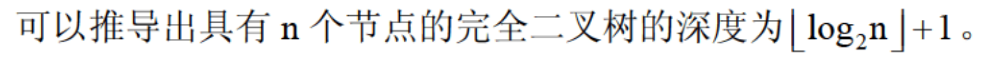
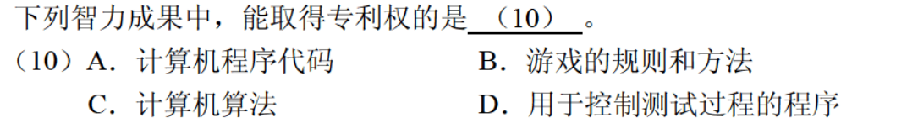
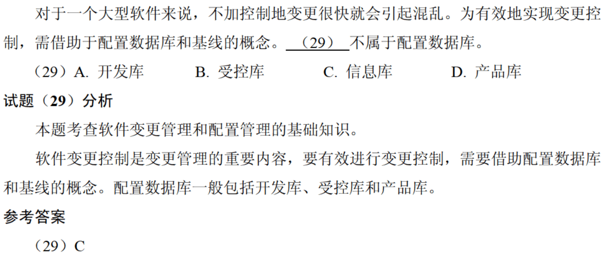
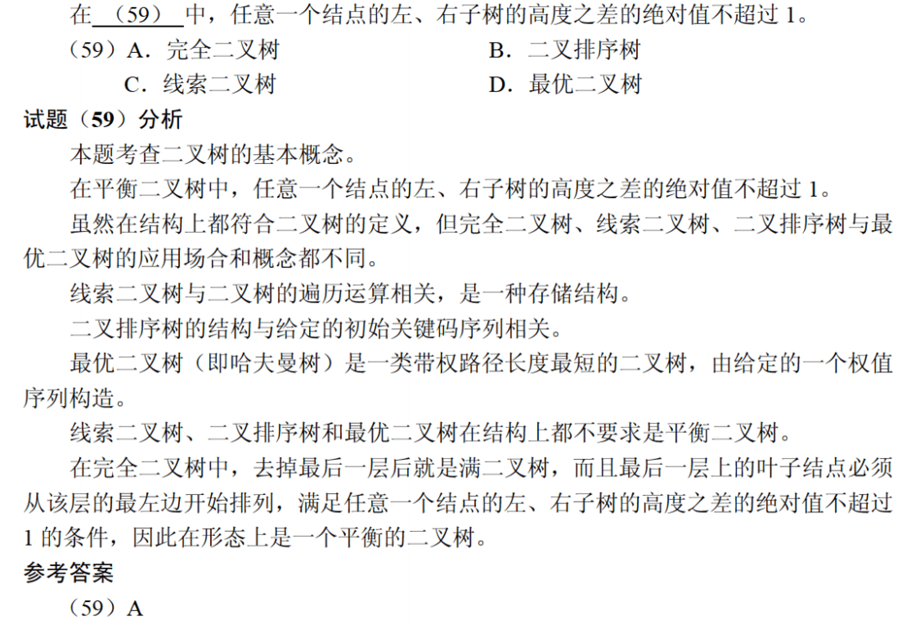
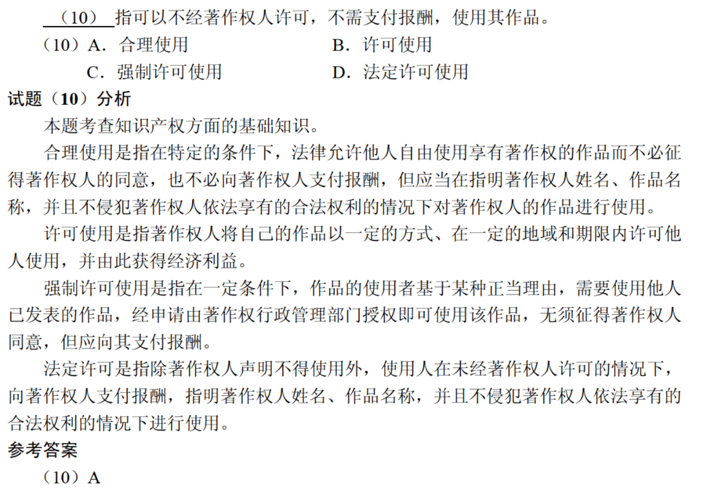
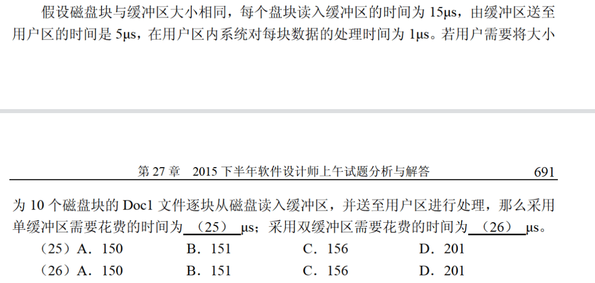

# 2009年上半年

考点：

海明码校验位数

$$2^k - 1 \ge n + k$$

海明码补充：

在一个码组内为了检测e个误码，最小码距要求为e+1

在一个码组内为了纠正e个误码，最小码距要求为2e+1

校验位计算：

纠错：将收到的校验位和收到的计算得到的校验位进行异或，得到的数字就是出错的位置。对这个位置取反则完成纠错。如图，收到校验位为101，正确校验位为001，则异或结果为100，说明第4为出错，取反后为1011101即为正确答案。

考点：

进程死锁（可能引起死锁条件）：

m < nw (n为互斥使用的进程数，w为进程最大资源需求)

一定不会出现死锁的条件：

$$m \ge n \times (w - 1) + 1$$

考点：

CMM

A中用了B的对象，所以B依赖于A。

整体消失，部分也消失，应该为组合关系。

整体消失，部分不消失，应该为聚合关系。

AOV：以顶点表示活动的网

AOE：带权有向图称为用边表示活动的网

答案为C。D正确

利用两个栈可以模仿队列，但是利用两个队列无法模仿栈。

完全二叉树更适合顺序存储结构。

考点：

路由

考点：

HTML中的一些标签

# 2009年下半年

考点：

浮点数

对阶的原则是小阶向大阶看齐，即小阶的位数向右移一位，其阶码加1，直到两数的阶码相等为止

海明校验码码距至少为3

CRC检错很强，无法纠错

影响Cache命中率：

1. 块大命中率高
2. 用全相联命中率高

3. 替换算法：在Cache容量较小的情况下，随机策略相对较好，而随着Cache容量的增加，最近最少使用（LRU）和先进先出（FIFO）策略的效果较好。所以一般的计算机默认的采用LRU替换策略。

本体选D，具体到应用的才能获得专利权

考点：面对对象分析

二叉树，先序遍历和后序遍历结合无法推出中序遍历

# 2010年上半年

与B等价(枚举即可)

6*(2 - 1)+ 1 == 7

注意：访问优先级大于修改优先级

最快即每块所占用时间×数量

初启：生命周期目标

精化：**生命周期架构**

构建：**初始运作功能**

移交：产品发布

# 2010年下半年

只有程序计数器不对程序员透明

E-R图的冲突

复合关系与派生关系的区别：

复合的是值

派生的是属性

两种取整方式的折半查找

**注意本题**

矩阵相乘的计算次数是全部乘起来，因此，率先消去中间大的矩阵，运算次数最少，计算量最小

# 2011年上半年

考点：

本题在于考察位视图的大小 即物理块的大小/位数 即为可表示的字数

考察多种二叉树

哈希表

插入排序： n - 1 + 逆序对数

归并排序：逆序对 * 2

# 2011年上午题

指令寄存器对用户是完全透明的

注意，这是按列存储

# 2015年上半年

1 / (1 / 200 * 5) * 4 = 160

虽然但是，19是没有办法的最短，最短的前提是能完成

C、B

完全二叉树，除最后一层外是满二叉树

选择排序为交换操作

# 2015年下半年

注意，先加1再减

单缓冲：

少处理  (15+ 5) * 10 + 1

双缓冲：

少送用户和处理  (15)*10 + 5 + 1

此类题带入即可

无向图为2e，有向图为e

# 2016年上半年

